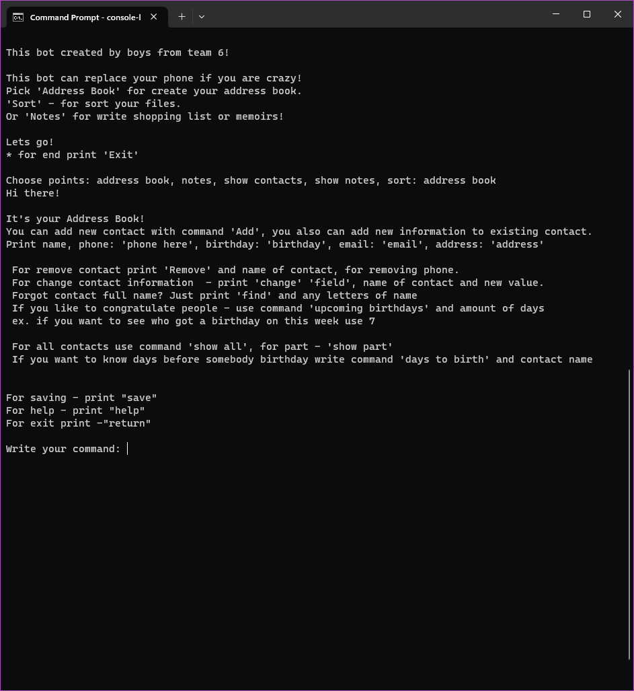

# Console bot helper

### Open terminal and type the following commands:

---------------------------------------------------------

 - > git clone https://github.com/3xecut0r/console-helper-bot.git
 - > cd console-helper-bot
 - > python setup.py install
 - > console-bot

---------------------------------------------------------

### if you want to run it in docker:

---------------------------------------------------------

---------------------------------------------------------

## Implementation 

- <b>help </b>if you forgot command

### Main menu:

---------------------------------------------------------
 - -> <b>Address book</b>  for create your address book.
 - -> <b>Sort</b> - for sort your files.
 - -> <b>Notes</b> - for write shopping list or memoirs!
 - -> <b>Exit</b> - to finish
---------------------------------------------------------
### Address book 

---------------------------------------------------------

- -> <b>Add</b> - creates contact
 Print name, phone: <b>phone here</b>, birthday: <b>birthday</b>, email: <b>email</b>, address: <b>address</b>
- -> <b>Remove</b> - removes contact. Removes name or phone
- -> <b>Change</b> - changes contact information. <b>change old_field new_field</b>, name of contact and new value.
- -> <b>Find</b> - find any letters of name and returns list of contacts where got a match
- -> <b>Upcoming birthdays</b> - returns a list of contacts whose birthdays in range selected(select in days) 
- upcoming birthdays 31
- -> <b>show all</b> - returns a list of whole address book
- -> <b>days to birth contact_name</b> - returns amount days to birthday selected contact
- -> <b>return</b> back to main menu

---------------------------------------------------------

### Notes

---------------------------------------------------------

- -> <b>Add your_note</b> creates new note. Also supports hashtags, for instance: add #helloWorld.  
Hashtags have special command <b>search</b>
- -> <b>Search #helloWorld</b> - searches note by hashtag 
- -> <b>Change note_name new_note</b> - name of note and new information.
- -> <b>remove note_name</b> removes note
- -> <b>show all</b> returns a list of all notes
- -> <b>return</b> back to main menu

---------------------------------------------------------

### Sorter

---------------------------------------------------------

- -> <b>sort C://path/to/your/folder</b> - sort files in folder by theirs extensions 
But be careful, it cant work if folder was sorted
---------------------------------------------------------
